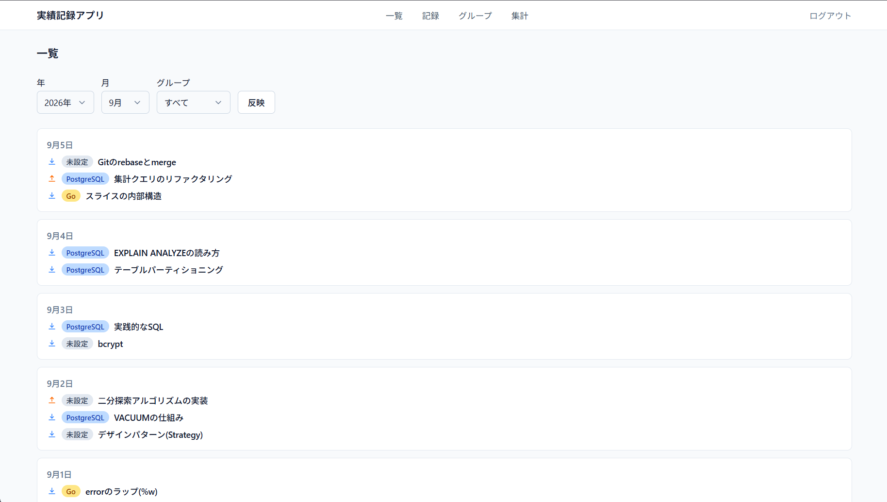

# 学習実績可視化

毎日の学習が積み上がっている実感を持てるようにするための、個人用の学習ログアプリです。

学習内容の正確さや理解度を採点する機能は持たせず、その日取り組んだことをそのまま記録し、日ごと・月ごとに積み上げを眺められることを目的としています。学習を目的とした個人開発プロジェクトです。



## コンセプト

- 「成長できたか」より「積み上げた感」を大事にする
- 理解度や達成度を数値でスコアリングしない（ジャンルを跨いだ比較は本質的に困難なため）
- 過去の記録は自由に編集・削除できる（水増しに意味がない設計のため、特別な制約は設けない）
- ゲーミフィケーション（ストリークやバッジ）で記録を煽らない。書かない日があってもよい

検討の経緯は [docs/思考プロセス_要件.md](docs/思考プロセス_要件.md)・[docs/思考プロセス_仕様.md](docs/思考プロセス_仕様.md) に、確定した仕様は [docs/仕様書.md](docs/仕様書.md)・[docs/技術仕様書.md](docs/技術仕様書.md) にまとめています。

## 機能

- **可視化画面**: 実績を日ごとのリストで表示。年月・グループでの絞り込みが可能
- **実績入力**: 日付・種別（インプット/アウトプット）・グループ・テーマ・内容を記録
- **グループ管理**: 実績をジャンルごとに分類し、色分け表示（紐づく実績があるグループは削除不可）
- **実績数確認**: 全体・グループ別・期間別の件数と、GitHubのcontribution graphに近いヒートマップ表示

## 技術スタック

| 区分 | 採用技術 |
|---|---|
| フレームワーク | [Next.js](https://nextjs.org/) (App Router) |
| スタイリング | [Tailwind CSS](https://tailwindcss.com/) |
| DB | [Neon](https://neon.tech/) (Serverless PostgreSQL) |
| ORM | [Drizzle ORM](https://orm.drizzle.team/) |
| バリデーション | [Zod](https://zod.dev/) + [drizzle-zod](https://orm.drizzle.team/docs/zod) |
| フォーム | [react-hook-form](https://react-hook-form.com/) |
| 認証 | 自前実装（bcrypt + JWTセッションCookie） |
| テスト | [Vitest](https://vitest.dev/)（単体・結合）、[Playwright](https://playwright.dev/)（E2E） |

採用理由や検討過程は [docs/技術仕様書.md](docs/技術仕様書.md) を参照してください。

## セットアップ

### 1. 依存関係のインストール

```bash
npm install
```

### 2. 環境変数の設定

`.env.local.example` を `.env.local` にコピーし、値を設定してください。

```bash
cp .env.local.example .env.local
```

| 変数 | 説明 |
|---|---|
| `DATABASE_URL` | NeonプロジェクトのPostgres接続文字列（プーリング接続） |
| `JWT_SECRET` | セッションJWTの署名鍵。`openssl rand -base64 32` などで生成 |

### 3. スキーマの反映

```bash
npm run db:migrate
```

### 4. 初期ユーザーの登録

このアプリはサインアップ画面を持たない単一ユーザー前提の設計です。以下の手順で1ユーザーだけ手動登録します。

```bash
node scripts/hash-password.mjs <パスワード>
```

出力されたハッシュ値を [drizzle/seed-initial-user.sql.example](drizzle/seed-initial-user.sql.example) のテンプレートに埋め込み、NeonのSQL Editorで実行してください。

### 5. 開発サーバーの起動

```bash
npm run dev
```

[http://localhost:3000](http://localhost:3000) を開くとログイン画面にリダイレクトされます。

## テスト

```bash
npm run lint        # ESLint
npm run typecheck   # 型チェック
npm run test        # 単体テスト（Vitest）
npm run test:integration  # 結合テスト（実DBが必要）
```

E2Eテスト（Playwright、`e2e/`）はCIには含めず、デプロイ前に手動実行する運用です。詳細は [docs/技術仕様書.md](docs/技術仕様書.md) を参照してください。

## ディレクトリ構成

```
├── docs/               # 検討過程・仕様書
├── drizzle/            # DBスキーマ・マイグレーション
├── e2e/                # E2Eテスト（Playwright）
├── scripts/            # 補助スクリプト
└── src/
    ├── actions/        # Server Actions
    ├── app/             # ルーティング（App Router）
    ├── components/      # UIコンポーネント
    ├── lib/             # DB接続・認証・日付処理等
    └── schemas/         # Zodバリデーションスキーマ
```
