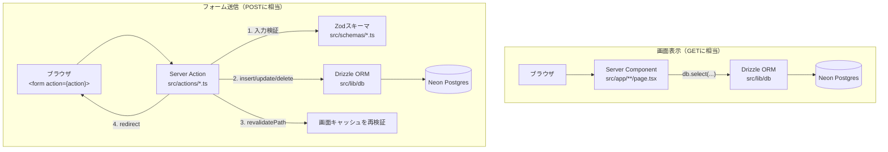
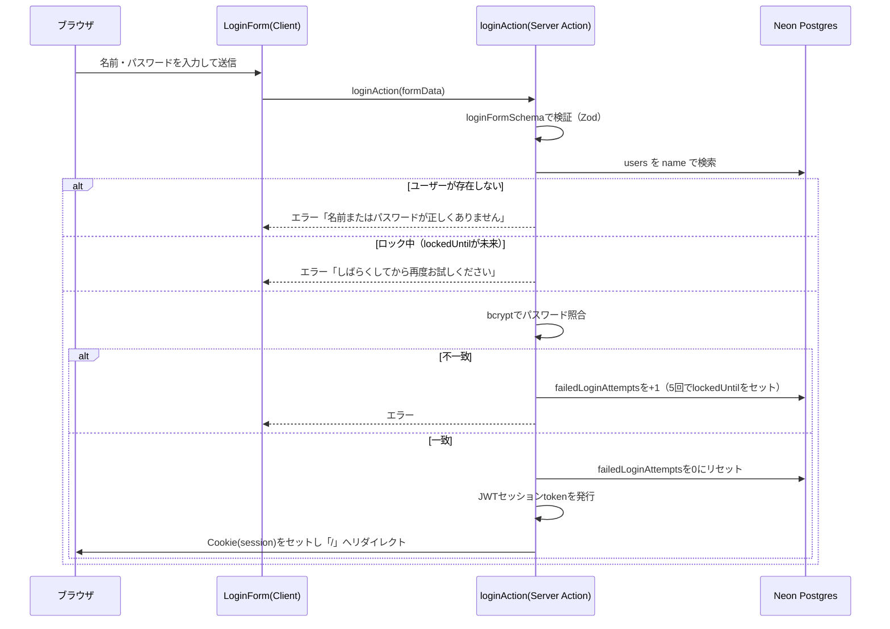
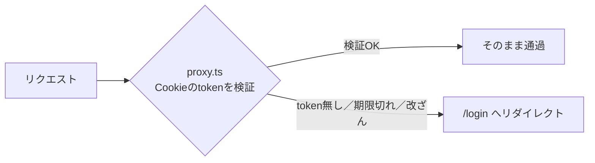
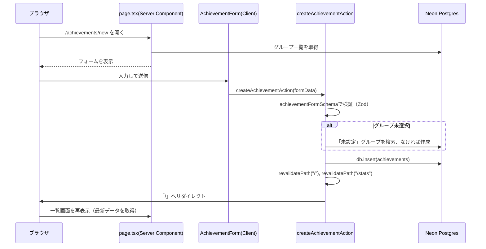
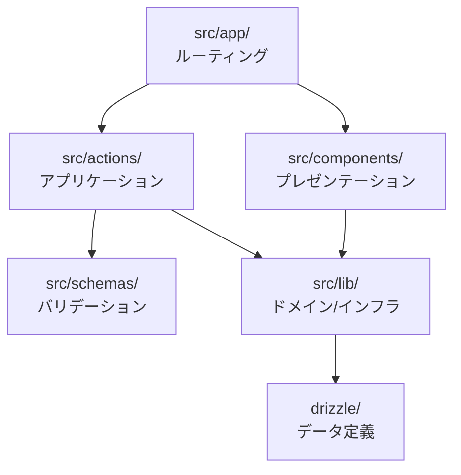
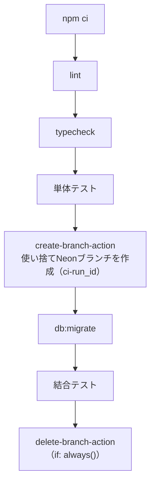

# アーキテクチャ

このドキュメントでは、学習実績可視化アプリが「どう動いているか」を、画面の一覧ではなく処理の流れの観点でまとめる。ディレクトリごとの役割は [ディレクトリ構成.md](./ディレクトリ構成.md) を参照。

## 全体像

このアプリには、いわゆる「フロントエンド」と「バックエンドAPI」の分離が存在しない。Next.jsのApp Routerが持つ2つの仕組みだけで完結している。

- **Server Components**（`src/app/**/page.tsx`）: 画面を開いたとき、サーバー側でDBに直接問い合わせて結果をHTMLとして返す。専用のAPIエンドポイントを経由しない
- **Server Actions**（`src/actions/*.ts`）: フォーム送信を受け取り、サーバー側で直接DBを更新する関数。これも専用のAPIエンドポイントを経由しない

REST APIやGraphQLを別途用意していないのは、フロントエンドとバックエンドを別々にホストする必要がない単一アプリだからである。Server Actionsは「フォームのaction属性に関数を直接渡せる」というNext.jsの機能で、ブラウザ側からはPOSTリクエストに見えるが、呼び出し側のコードはただの関数呼び出しとして書ける。

## 認証・認可の仕組み

このアプリはサインアップ画面を持たない単一ユーザー前提のアプリで、認証は外部サービス（Auth0やNextAuthなど）を使わず自前実装している。

### ログイン時（[login-form.tsx](../src/components/auth/login-form.tsx) → [loginAction](../src/actions/auth.ts)）

1. フォームが `loginAction` を呼ぶ（`useActionState` でpending状態とエラーメッセージを管理）
2. 入力を `loginFormSchema`（Zod）で検証
3. `users` テーブルから名前でユーザーを検索
4. アカウントロック中（`lockedUntil` が未来）ならエラーを返す
5. `bcrypt` でパスワードハッシュを照合（[password.ts](../src/lib/auth/password.ts)）
6. 失敗時: `failedLoginAttempts` を+1し、5回に達したら15分ロック
7. 成功時: 失敗カウントをリセットし、`userId` を含むJWTを発行（[session.ts](../src/lib/auth/session.ts)）してHTTP OnlyのCookieに保存し、`/` へリダイレクト

### 以後のリクエスト（[proxy.ts](../src/proxy.ts)）

Next.jsのミドルウェアとして動作し、`/login` 以外の全リクエストで以下を行う。

1. Cookieからセッションtoken を取り出す
2. JWTを検証（`jose` ライブラリ、署名鍵は環境変数 `JWT_SECRET`）
3. 検証に失敗（未ログイン・期限切れ・改ざん）なら `/login` へリダイレクト
4. 成功なら素通りさせる

各Server Component / Server Actionは `getCurrentUserId()` を呼んで現在のユーザーIDを取得し、DBクエリの `where` 句に必ず付与する（他ユーザーのデータが見えないようにする、という素朴なマルチテナント対策）。ミドルウェアで弾いているため通常はnullにならないが、呼び出し側でも念のためnullチェックしている。

## データの流れ（実績の新規作成を例に）

1. `/achievements/new`（[page.tsx](../src/app/(protected)/achievements/new/page.tsx)）がServer Componentとして、フォームに表示するグループ一覧をDBから取得
2. `<AchievementForm>`（Client Component）が `createAchievementAction` を `useActionState` 経由でフォームに紐づける
3. 送信されると `createAchievementAction`（[achievements.ts](../src/actions/achievements.ts)）が実行される
   - `achievementFormSchema`（Zod、`drizzle-zod` で `achievements` テーブルの型から自動生成）で入力を検証
   - グループ未選択の場合は「未設定」グループを検索し、なければ自動作成（`resolveGroupId`）
   - `db.insert(achievements)` で保存
   - `revalidatePath("/")` と `revalidatePath("/stats")` で、一覧・集計画面のキャッシュを無効化
   - `/` へリダイレクト
4. リダイレクト先の一覧画面は、次回表示時にServer Componentとして再度DBから最新データを取得する

この「Zodスキーマで検証 → Drizzleで更新 → revalidatePath → redirect」という4ステップは、`groups.ts` のServer Actionsでも同じ形をとっている。

## レイヤー構成

| レイヤー | 置き場所 | 責任 | やらないこと |
|---|---|---|---|
| ルーティング | `src/app/` | URLとページの対応づけ、認証ガード（`proxy.ts`） | DBクエリの詳細やバリデーションロジックを持たない（`lib`/`schemas`に委譲） |
| プレゼンテーション | `src/components/` | 見た目の描画、フォームの状態管理（`useActionState`/`useState`） | DBアクセスやビジネスルールを持たない |
| アプリケーション | `src/actions/` | フォーム入力を受け、検証→DB操作→再検証を仲介する | 見た目（JSX）を持たない |
| バリデーション | `src/schemas/` | 入力データの形式チェックとエラーメッセージ | DBアクセスをしない（純粋な検証のみ） |
| ドメイン/インフラ | `src/lib/` | DB接続、認証、日付計算など画面に依存しない共通ロジック | 特定の画面の都合に依存しない汎用的な実装にする |
| データ定義 | `drizzle/` | テーブル構造そのものと変更履歴 | アプリケーションロジックを持たない |

依存の方向は上から下（`app` → `actions`/`components` → `schemas`/`lib` → `drizzle`）で、逆方向の依存（例えば`lib`が`app`を参照する）は存在しない。

## 主要な設計判断とその理由

- **サインアップ画面を持たない単一ユーザー設計**: 個人の学習ログという用途上、複数ユーザー対応やアカウント管理機能は不要と判断。初期ユーザーは `scripts/hash-password.mjs` でハッシュを生成し、Neonコンソールから手動でSQLを実行して1人だけ登録する運用（[README.md](../README.md)参照）
- **REST/GraphQL APIを持たずServer Componentsが直接DBを読む**: フロントエンドを別ホストで動かす予定がなく、API層を挟む複雑さに見合うメリットがないため
- **Server Actionsでフォームを処理する**: API Routesを個別に作らずに済み、フォームの型とサーバー処理を1ファイルにまとめられる
- **認証は外部サービスを使わず自前実装（bcrypt + JWT Cookie）**: 単一ユーザーかつソーシャルログイン等が不要なため、外部依存を増やさない選択
- **Neonのサーバーレスドライバ（`neon-http`）を採用**: HTTP経由でDBにアクセスするドライバで、コネクションプールの管理が不要。サーバーレス環境（Vercel等）と相性が良い
- **バリデーションスキーマをDBスキーマから自動生成（`drizzle-zod`）**: テーブル定義とバリデーションルールの二重管理を避けるため

## テスト戦略

| 種別 | 対象 | 実行タイミング |
|---|---|---|
| 単体テスト（Vitest, `*.test.ts`） | `schemas/`のバリデーション、`lib/date.ts`の日付計算など、DBに依存しない純粋なロジック | CIで毎回（`npm run test`） |
| 結合テスト（Vitest, `*.integration.test.ts`） | DBに実際に書き込む処理（例: グループ削除時の制約） | CIで毎回、Neonの使い捨てブランチに対して実行（`npm run test:integration`） |
| E2Eテスト（Playwright, `e2e/`） | ログイン〜実績記録〜一覧表示までの一連の操作 | CIには含めず、デプロイ前に手動実行 |

## CI/CDフロー（[.github/workflows/ci.yml](../.github/workflows/ci.yml)）

1. `npm ci` → `lint` → `typecheck` → `test`（単体テスト）
2. `neondatabase/create-branch-action` で、CI実行ごとに一意な名前（`ci-${{ github.run_id }}`）の使い捨てNeonブランチを作成
3. そのブランチに対して `db:migrate` でスキーマを反映
4. そのブランチに対して結合テストを実行
5. `if: always()` により、途中の成否に関わらず最後にそのブランチを削除

本番用のNeonプロジェクトとは別のブランチ（Neonのブランチ機能＝本番データのコピーオンライトな分岐）を使うことで、結合テストが本番データに影響を与えないようにしている。
