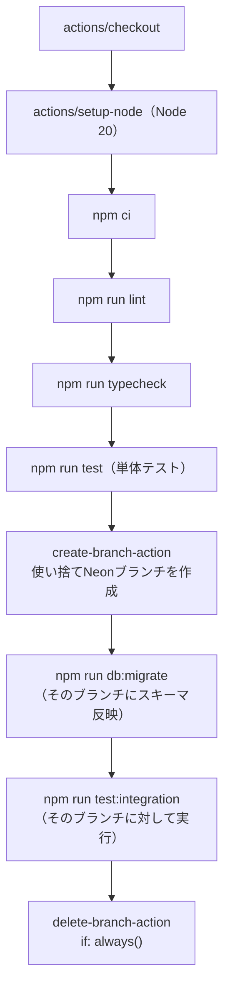

# CI

このアプリのCIは [.github/workflows/ci.yml](../../.github/workflows/ci.yml) の1ファイルで完結する、GitHub Actionsのワークフロー。`main`ブランチへのpushと、すべてのPull Requestで自動実行される。

## 全体の流れ



前半（checkoutからtestまで）は一般的なNode.jsプロジェクトのCIと変わらない。特徴的なのは後半で、結合テストのために**実行のたびに使い捨てのNeonブランチを作り、終わったら消す**という仕組みを取り入れている点。

## ステップ解説

### 1. セットアップ〜単体テスト

```yaml
- uses: actions/checkout@v4
- uses: actions/setup-node@v4
  with:
    node-version: 20
    cache: npm
- run: npm ci
- run: npm run lint
- run: npm run typecheck
- run: npm run test
```

`node-version: 20`を明示しているのは、開発者ごとにローカルのNodeバージョンが違っても、CI上では常に同じバージョンで検証するため。`npm ci`は`package-lock.json`の内容を厳密に再現してインストールするコマンドで、`npm install`と違ってロックファイルを書き換えない（詳しくは後述のコラム参照）。

### 2. Create Neon branch

```yaml
- name: Create Neon branch
  id: neon-branch
  uses: neondatabase/create-branch-action@v5
  with:
    project_id: ${{ secrets.NEON_PROJECT_ID }}
    api_key: ${{ secrets.NEON_API_KEY }}
    branch_name: ci-${{ github.run_id }}
```

Neonの「ブランチ」は、本番DBのスナップショットをコピーオンライトで複製できる機能。このステップで、本番と同じスキーマ・データを持つ使い捨てのDBブランチを1つ作り、`id: neon-branch`という名前で以後のステップから参照できるようにする。`branch_name`にはCI実行ごとに一意な`github.run_id`を含めており、複数のCI実行が同時に走っても名前が衝突しない。

`project_id`と`api_key`はNeon側の認証情報で、リポジトリの GitHub Secrets（Settings → Secrets and variables → Actions）に登録しておく必要がある。

### 3. マイグレーション〜結合テスト

```yaml
- name: Run migrations against the branch
  run: npm run db:migrate
  env:
    DATABASE_URL: ${{ steps.neon-branch.outputs.db_url }}

- name: Run integration tests
  run: npm run test:integration
  env:
    DATABASE_URL: ${{ steps.neon-branch.outputs.db_url }}
```

`steps.neon-branch.outputs.db_url`は、1つ前のステップが作成したブランチへの接続文字列。これを一時的に`DATABASE_URL`として渡すことで、本番DBには一切触れずに「マイグレーションを実際に適用できるか」「制約（外部キーなど）が想定通り効くか」を検証できる（結合テストの内容自体は [test_結合.md](./test_結合.md) を参照）。

### 4. Delete Neon branch

```yaml
- name: Delete Neon branch
  if: always()
  uses: neondatabase/delete-branch-action@v3
  with:
    project_id: ${{ secrets.NEON_PROJECT_ID }}
    api_key: ${{ secrets.NEON_API_KEY }}
    branch: ${{ steps.neon-branch.outputs.branch_id }}
```

`if: always()`が付いているため、途中のステップ（マイグレーションや結合テスト）が失敗しても必ず実行される。これを付けていないと、テストが失敗するたびに使い捨てブランチが消されずに残り続け、Neonプロジェクトのブランチ数上限に達してしまう。

## トラブルシューティングの記録

このCIは実際に運用する中で、以下の不具合を踏んで修正している。原因の切り分け方も含めて記録しておく。

### `npm ci`が`EUSAGE`で失敗する（esbuildが見つからない）

**症状**: `npm error code EUSAGE` / `Missing: esbuild@x.x.x from lock file`のようなエラーで`npm ci`自体が失敗する。

**原因**: npm 11系が`package-lock.json`に書き込む`"libc": ["glibc"]`のようなフィールドを、CIランナー（`actions/setup-node@v4`でNode 20を指定すると付属するnpmは10.8.2）が正しく解釈できず、実際には存在するパッケージを「ロックファイルに無い」と誤判定する。ローカルでnpm 11を使って`npm install`し直すと、この非互換なロックファイルが再生成されてしまい、何度直しても同じエラーが再発する。

**対処**: Node 20 / npm 10.8.2と同じ環境（Dockerの`node:20`イメージなど）で`npm install`してロックファイルを作り直し、以後ローカルでは`npm ci`（ロックファイルを書き換えない）だけを使うようにする。`npm install`はロックファイルを問答無用で「今使っているnpmの流儀」に書き換えてしまうため、CIと異なるnpmバージョンで気軽に実行しないことが重要。

### Neonブランチの作成が`Cannot run interactive auth in CI`で失敗する

**原因**: `NEON_API_KEY`のSecretが未設定または空。`neonctl`（Neon CLI）がAPIキーを受け取れないと、対話的ログインにフォールバックしようとしてCI環境で失敗する。

**対処**: GitHubリポジトリの Settings → Secrets and variables → Actions で`NEON_API_KEY`を設定する。

### Neonブランチの作成が`ERROR: project not found`で失敗する

**原因**: `NEON_PROJECT_ID`のSecretが未設定または誤った値になっている。

**対処**: Neonコンソールでプロジェクトの実際のProject IDを確認し、Secretを設定・修正する。

### Neonブランチの作成が`branch (invalid: name (string: len 0 less than minimum 1))`で失敗する

**原因**: `neondatabase/create-branch-action@v5`は、`branch_name`を指定しないと空文字列を`neonctl branches create --name ""`としてそのまま渡してしまう（ドキュメント上は「省略時は自動生成」とあるが、実際のaction.ymlの実装はそうなっていなかった）。空文字列はNeon側のバリデーションで「1文字以上必要」として拒否される。

**対処**: `branch_name: ci-${{ github.run_id }}`のように、空にならない値を明示的に指定する。

### `Create Neon branch`の失敗が原因で`Delete Neon branch`も失敗する

**症状**: `Delete Neon branch`ステップで`Not enough non-option arguments: got 0, need at least 1`のようなエラーが出る。

**原因**: `Delete Neon branch`は`if: always()`のため、直前の`Create Neon branch`が失敗して`steps.neon-branch.outputs.branch_id`が空のままでも実行される。空のブランチIDで削除コマンドを叩こうとして失敗する。これは**結果であって原因ではない**——本当の原因は必ず`Create Neon branch`側にある。

**教訓**: CIのログで最後に表示されているエラーが、必ずしも根本原因とは限らない。ジョブの各ステップを最初から順番に確認し、最初に失敗しているステップを特定することが重要（GitHub Actionsの実行画面、または`gh run view <run-id> --log`で確認できる）。
