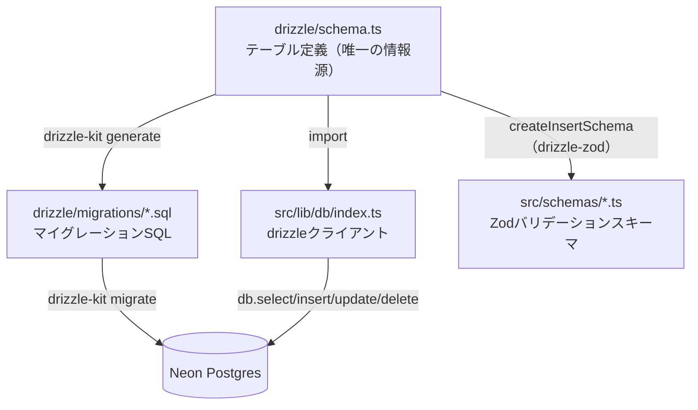

# ORMの設定

このアプリのDBアクセスはすべて [Drizzle ORM](https://orm.drizzle.team/) 経由で行う。生SQLを直接書く箇所はなく、`drizzle-kit`（CLI）と`drizzle-orm`（実行時ライブラリ）の2つで構成される。

## 全体像



`schema.ts`を起点に「DBの実体」「TypeScriptの型」「フォームのバリデーション」の3つがすべて導出される、という点がこのアプリのORM周りの設計で最も重要な考え方になる。

## drizzle.config.ts

```ts
export default defineConfig({
  schema: "./drizzle/schema.ts",
  out: "./drizzle/migrations",
  dialect: "postgresql",
  dbCredentials: {
    url: process.env.DATABASE_URL!,
  },
});
```

[drizzle.config.ts](../../drizzle.config.ts)は`drizzle-kit`（CLI）専用の設定ファイルで、アプリの実行時には読み込まれない。「どのファイルがスキーマ定義か」「マイグレーションSQLをどこに出力するか」「どのDBに接続するか」を`drizzle-kit generate`/`drizzle-kit migrate`コマンドに伝える役割を持つ。`.env.local`を読むために冒頭で`dotenv`の`config()`を呼んでいる（Next.js本体は`.env.local`を自動で読むが、CLI単体では読まれないため）。

## src/lib/db/index.ts（実行時のDB接続）

```ts
import { neon } from "@neondatabase/serverless";
import { drizzle } from "drizzle-orm/neon-http";
import * as schema from "@drizzle/schema";

const sql = neon(process.env.DATABASE_URL!);
export const db = drizzle(sql, { schema });
```

ここがアプリの実行時に実際にDBへ問い合わせる唯一の窓口。ポイントは`drizzle-orm/neon-http`という、Neon専用の「HTTPドライバ」を使っていること。

- 通常のPostgresクライアント（`pg`など）はTCPでコネクションを張り続け、コネクションプールを管理する必要がある
- `neon-http`は1クエリ＝1回のHTTPリクエストとして扱うため、コネクションプールという概念自体が不要になる
- サーバーレス環境（Vercelの各リクエストが短命な実行環境で処理される構成）と相性がよく、「コネクション上限に達する」といった問題が起きにくい

この`db`オブジェクトは`src/actions/*.ts`（Server Actions）と`src/app/**/page.tsx`（Server Components）の両方から`import { db } from "@/lib/db"`として使われる。DBアクセスの経路がこの1箇所に集約されているため、接続方式を変えたくなった場合もこのファイルだけを直せばよい。

## drizzle/schema.ts（スキーマ定義）

```ts
export const achievements = pgTable("achievements", {
  id: serial("id").primaryKey(),
  userId: integer("user_id").notNull().references(() => users.id),
  groupId: integer("group_id")
    .notNull()
    .references(() => achievementGroups.id, { onDelete: "restrict" }),
  date: date("date").notNull().defaultNow(),
  type: achievementTypeEnum("type").notNull(),
  theme: varchar("theme", { length: 300 }).notNull(),
  content: text("content"),
});
```

`pgTable`でテーブルを、`pgEnum`でPostgresのENUM型を定義する。カラム名はキャメルケース（`groupId`）で書きつつ、実際のDB上のカラム名はスネークケース（`group_id`）で生成される。外部キー制約（`.references(...)`）や`ON DELETE RESTRICT`（`{ onDelete: "restrict" }`）もこの中に宣言的に書け、これがそのままマイグレーションSQLに反映される（テーブル構成の詳細は [db_tables.md](./db_tables.md) 参照）。

さらに`relations()`で`users` ⇄ `achievementGroups` ⇄ `achievements`の関連を定義しており、これによりリレーション先を含めたクエリ（`db.query.achievements.findMany({ with: { group: true } })`のような書き方）が型安全に書けるようになる（現状のコードでは主に個別の`select`/`insert`/`update`/`delete`を組み合わせて使っている）。

## マイグレーションのワークフロー

| コマンド | 実行タイミング | 役割 |
|---|---|---|
| `npm run db:generate`（`drizzle-kit generate`） | `schema.ts`を変更したとき | 現在のDBの状態（`drizzle/migrations/meta/`のスナップショット）と`schema.ts`を比較し、差分のSQLファイルを`drizzle/migrations/`に生成する |
| `npm run db:migrate`（`drizzle-kit migrate`） | 生成されたマイグレーションを適用したいとき（初回セットアップ・CI・本番デプロイ前など） | 未適用のマイグレーションSQLを`DATABASE_URL`が指すDBに対して順番に実行する |

つまり「スキーマを変更する」というのは、`schema.ts`を編集して`db:generate`でSQLを生成し、それをレビュー・コミットしてから`db:migrate`で実際のDBに反映する、という2段階の流れになる。マイグレーションSQL自体を手で書き換えることは基本的にしない（`drizzle-kit`が生成した内容をそのまま使う）。

CIでは、本番用DBではなくNeonの使い捨てブランチに対してこの`db:migrate`を実行し、結合テストを行っている（詳細は [ci.md](./ci.md)・[test_結合.md](./test_結合.md) を参照）。

## drizzle-zod（バリデーションとの統合）

```ts
export const achievementFormSchema = createInsertSchema(achievements, {
  theme: (schema) => schema.trim().min(1, "テーマを入力してください"),
  content: (schema) => schema.trim().max(3000, "内容は3000文字以内で入力してください"),
})
  .omit({ id: true, userId: true, groupId: true })
  .extend({
    groupId: z.coerce.number().int().positive().optional(),
  });
```

[schemas/achievement.ts](../../src/schemas/achievement.ts)や[schemas/group.ts](../../src/schemas/group.ts)では、`drizzle-zod`の`createInsertSchema`を使い、`schema.ts`のテーブル定義からZodのバリデーションスキーマを自動生成している。テーブル側で`varchar("theme", { length: 300 })`と定義した文字数上限が、そのままZod側にも引き継がれる。第2引数のオブジェクトで、DBの型だけでは表現できない追加ルール（空文字禁止のメッセージなど）を上書きできる。

一方[schemas/auth.ts](../../src/schemas/auth.ts)のログインフォームは`drizzle-zod`を使わず手書きしている。これは`users.passwordHash`（ハッシュ化済み文字列）と、ログインフォームが受け取る平文パスワードが1対1に対応しないため。「DBのテーブル定義」と「フォームの入力」が一致しない場合は自動生成せず手書きする、という使い分けをしている。
