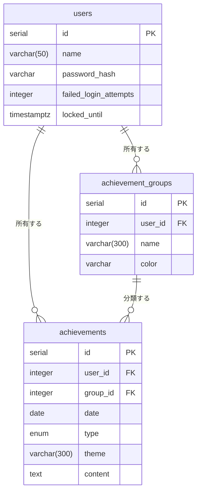

# テーブル構成

DBスキーマの唯一の情報源は [drizzle/schema.ts](../../drizzle/schema.ts)。ここに定義した内容から、マイグレーションSQL・TypeScriptの型・バリデーションスキーマ（`drizzle-zod`）がすべて導出される。

## ER図



## users（ユーザー）

このアプリはサインアップ画面を持たない単一ユーザー前提のため、`users` テーブルは通常1行しか持たない。それでもテーブルとして分離しているのは、ログイン試行回数の制限をユーザーに紐づけて保持するため。

| カラム | 型 | 制約 | 役割 |
|---|---|---|---|
| `id` | `serial` | PRIMARY KEY | 内部ID |
| `name` | `varchar(50)` | NOT NULL | ログイン名（[loginFormSchema](../../src/schemas/auth.ts)で50文字以内を強制） |
| `password_hash` | `varchar` | NOT NULL | bcryptでハッシュ化したパスワード。平文は一切保存しない |
| `failed_login_attempts` | `integer` | NOT NULL, DEFAULT 0 | ログイン連続失敗回数 |
| `locked_until` | `timestamptz` | NULL許容 | この日時までロック中（5回失敗で15分間、[loginAction](../../src/actions/auth.ts)が設定） |

初期ユーザーはアプリのUIからは作成できず、[scripts/hash-password.mjs](../../scripts/hash-password.mjs)でハッシュを生成し、[drizzle/seed-initial-user.sql.example](../../drizzle/seed-initial-user.sql.example)を元にNeonのSQL Editorで直接1行INSERTする運用（README参照）。

## achievement_groups（実績のグループ）

実績を「JavaScript」「Go」のようなジャンルで分類するためのテーブル。

| カラム | 型 | 制約 | 役割 |
|---|---|---|---|
| `id` | `serial` | PRIMARY KEY | 内部ID |
| `user_id` | `integer` | NOT NULL, FK → `users.id` | 所有者 |
| `name` | `varchar(300)` | NOT NULL | グループ名 |
| `color` | `varchar` | NOT NULL, DEFAULT `'slate'` | バッジの色。[colors.ts](../../src/lib/colors.ts)で定義する固定パレットの中から選ぶ |

グループを選ばずに実績を記録すると、`createAchievementAction`内の`resolveGroupId`（[achievements.ts](../../src/actions/achievements.ts)）が「未設定」という名前のグループを検索し、なければ自動作成してそれを使う。つまりアプリ上「グループなし」という状態は存在せず、必ずどこかのグループに属する。

## achievements（実績）

このアプリの中心となるテーブル。1件の学習ログ（インプットまたはアウトプット1つ）を表す。

| カラム | 型 | 制約 | 役割 |
|---|---|---|---|
| `id` | `serial` | PRIMARY KEY | 内部ID |
| `user_id` | `integer` | NOT NULL, FK → `users.id` | 所有者 |
| `group_id` | `integer` | NOT NULL, FK → `achievement_groups.id`, **ON DELETE RESTRICT** | 分類先グループ |
| `date` | `date` | NOT NULL, DEFAULT `now()` | 実績の日付（時刻を持たない） |
| `type` | `achievement_type`（ENUM: `input` \| `output`） | NOT NULL | インプット（学んだ）かアウトプット（作った・書いた）か |
| `theme` | `varchar(300)` | NOT NULL | 何をやったか（例:「実践的なSQL」） |
| `content` | `text` | NULL許容 | 詳細メモ。DB上は文字数無制限だが、[achievementFormSchema](../../src/schemas/achievement.ts)で3000文字までに制限 |

### `group_id` の `ON DELETE RESTRICT` について

`achievements.group_id` の外部キーは [drizzle/migrations/0000_tan_alice.sql](../../drizzle/migrations/0000_tan_alice.sql) で `ON DELETE restrict` に設定されている。これは「実績が1件でも紐づいているグループは削除できない」という仕様書4.4の制約を、アプリのコードではなくDB自体に強制させるためのもの。

```mermaid
flowchart LR
    U[ユーザーがグループ削除を実行] --> A["deleteGroupAction<br/>src/actions/groups.ts"]
    A --> D["db.delete(achievementGroups)"]
    D --> DB{(Postgres)}
    DB -- 紐づくachievementsが0件 --> OK[削除成功]
    DB -- 紐づくachievementsが1件以上 --> NG["外部キー違反（23503）"]
    NG --> A2["catchして<br/>「紐づく実績があるため削除できません」を返す"]
```

`deleteGroupAction`（[groups.ts](../../src/actions/groups.ts)）はこの違反をアプリ側で先読みチェックせず、DBに削除させてみて、返ってきたPostgresのエラーコード`23503`（foreign_key_violation）を`catch`してユーザー向けメッセージに変換している。「削除前に紐づく実績があるか毎回SELECTする」という余分なクエリを書かずに済み、かつ競合状態（チェックした直後に別処理が実績を追加する、等）にも強い設計になっている。

### `date` を文字列ベースで扱う理由

DB上は`date`型だが、アプリのコードでは`formatDateKey(date) => date.toISOString().slice(0, 10)`で`"YYYY-MM-DD"`形式の文字列に変換して扱う（[page.tsx](../../src/app/(protected)/page.tsx)ほか）。ゼロ埋めされた固定長の文字列であるため、`<`や`>=`といった文字列比較がそのまま日付の前後比較として正しく機能し、`WHERE date >= '2026-08-01' AND date <= '2026-08-31'`のような範囲検索を素直に書ける。

## 関連ドキュメント

- ORMの設定・マイグレーションの回し方は [db_orm.md](./db_orm.md)
- テーブル定義から自動生成されるバリデーションについては [アーキテクチャ.md](../アーキテクチャ.md) の「主要な設計判断とその理由」を参照
