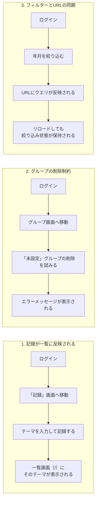

# E2Eテスト

フレームワークは [Playwright](https://playwright.dev/)。設定ファイルは [playwright.config.ts](../../playwright.config.ts)、テスト本体は [e2e/golden-paths.spec.ts](../../e2e/golden-paths.spec.ts)の1ファイル。

```ts
export default defineConfig({
  testDir: "./e2e",
  fullyParallel: true,
  use: {
    baseURL: process.env.E2E_BASE_URL ?? "http://localhost:3000",
  },
  projects: [
    { name: "chromium", use: { ...devices["Desktop Chrome"] } },
  ],
});
```

単体テスト・結合テストがコードの内部ロジックやDBの制約を検証するのに対し、E2Eテストは実際にブラウザ（Chromium）を操作して、ユーザーが行う一連の操作が画面をまたいで正しく成立するかを検証する。`baseURL`は環境変数`E2E_BASE_URL`で切り替えられ、指定がなければローカルの開発サーバー（`http://localhost:3000`）を対象にする。

## CIには含めず、手動実行にしている理由

[ci.md](./ci.md)で解説したCIのステップにE2Eテストは登場しない。理由は主に2つ。

1. **ログイン可能な初期ユーザーが必要**: このアプリはサインアップ画面を持たないため、E2Eテストの実行にはあらかじめ「名前・パスワードが分かっているユーザー」がDBに存在している必要がある。CIが使い捨てるNeonブランチ（[ci.md](./ci.md)参照）にはそのようなユーザーがいないため、そのままでは実行できない
2. **実行コストと安定性**: ブラウザを起動して画面遷移を伴うE2Eテストは、単体・結合テストに比べて実行時間が長く、ネットワークやタイミングに起因するflaky（不安定）なテストになりやすい。すべての変更に対して毎回実行するよりも、デプロイ前の最終確認として手動で実行する運用の方が費用対効果が高いと判断している

## 環境変数によるスキップ制御

```ts
const userName = process.env.E2E_USER_NAME;
const userPassword = process.env.E2E_USER_PASSWORD;

test.skip(
  !userName || !userPassword,
  "E2E_USER_NAME / E2E_USER_PASSWORD が未設定のためスキップ",
);
```

`E2E_USER_NAME`・`E2E_USER_PASSWORD`という2つの環境変数が設定されていない場合、ファイル内の全テストが`test.skip`によってスキップされる。これにより、認証情報を用意していない環境で誤ってこのテストを実行してしまっても、失敗ではなく「スキップ」として扱われ、CIの通常フローを壊さない（[test_結合.md](./test_結合.md)の`DATABASE_URL`未設定時のスキップと同じ考え方）。

## ゴールデンパス3点

「ゴールデンパス」とは、そのアプリの中で最も重要でよく使われる操作の流れのことで、すべての画面・すべての分岐を網羅するのではなく、ここが壊れたら致命的、という経路に絞ってテストする方針を指す（技術仕様書5.3）。



### 1. ログイン→実績登録→一覧画面に反映される

```ts
await login(page);
await page.getByRole("link", { name: "記録" }).click();
const theme = `E2Eテスト ${Date.now()}`;
await page.getByLabel("テーマ").fill(theme);
await page.getByRole("button", { name: "記録する" }).click();

await expect(page).toHaveURL("/");
await expect(page.getByText(theme)).toBeVisible();
```

このアプリの最も基本的な用途（学習した内容を記録し、それが一覧に出る）そのものを検証する。テーマ名に`Date.now()`を混ぜているのは、何度実行しても一意な文字列になるようにし、過去の実行結果と混同しないようにするため。

### 2. 実績が紐づくグループは削除できない

```ts
await page
  .getByRole("listitem")
  .filter({ hasText: "未設定" })
  .getByRole("button", { name: "削除" })
  .click();
page.once("dialog", (dialog) => dialog.accept());

await expect(page.getByText("紐づく実績があるため削除できません")).toBeVisible();
```

[db_tables.md](./db_tables.md)で解説した`ON DELETE RESTRICT`制約が、結合テストのようにDBレベルだけでなく、実際の画面操作を通じてユーザーにエラーメッセージとして正しく伝わるかを確認している。「未設定」グループには（1つ目のテストで作成した実績も含め）常に実績が紐づいている前提でテストが書かれている。`page.once("dialog", ...)`は削除ボタン押下時に出る確認ダイアログ（`confirm()`）を自動的に受け入れる処理。

### 3. 一覧画面のフィルターがURLクエリに反映され、リロードしても保持される

```ts
await page.getByLabel("年").selectOption("2026");
await page.getByLabel("月").selectOption("1");
await page.getByRole("button", { name: "反映" }).click();

await expect(page).toHaveURL(/year=2026&month=1/);
await page.reload();
await expect(page).toHaveURL(/year=2026&month=1/);
```

一覧画面の年月フィルターが、コンポーネントの内部状態（`useState`など）ではなくURLクエリパラメータ（`?year=2026&month=1`）で管理されていることを確認する。URLに状態が乗っているため、ページをリロードしても、あるいはそのURLを直接ブックマーク・共有しても、同じ絞り込み結果を再現できる。

## 実行方法

```bash
npx playwright test
```

事前に開発サーバー（`npm run dev`）を起動し、対象のDBに認証情報が分かっているユーザーが存在する状態で、`E2E_USER_NAME`・`E2E_USER_PASSWORD`（必要なら`E2E_BASE_URL`も）を設定してから実行する。デプロイ前の最終確認として手動で実行する運用（[README.md](../../README.md)参照）。
